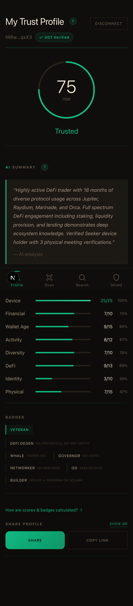

# TrustTap+: On-Chain Reputation for Solana Seeker

A mobile-first trust scoring system that analyzes Solana wallet history to generate verifiable reputation scores, gated exclusively for Saga Genesis Token holders.

[](https://www.typescriptlang.org/)
[](https://nextjs.org/)
[](https://solanamobile.com/)
[]()
[](LICENSE)



## Live Demo

<!-- TODO: Add Vercel URL after deployment -->

## Demo Video

<!-- TODO: Add YouTube link after recording -->

---

## What Is TrustTap+?

TrustTap+ turns your Solana wallet history into a trust score from 0 to 100. It reads on-chain data through the Helius RPC API and scores wallets across 8 dimensions: device ownership (SGT), financial depth, wallet age, transaction activity, protocol diversity, DeFi participation, identity signals, and physical meeting verification.

Only Saga Genesis Token holders can access the full platform. This creates a trusted community layer on Solana Mobile where every member's reputation is backed by verifiable on-chain activity.

---

## Screenshots

| Profile | Search | Level Up |
|---------|--------|----------|
|  |  |  |

| QR Scan | Sybil Shield |
|---------|-------------|
|  |  |

---

## Features

- **8-Dimension Trust Score**: Device (SGT), financial depth, wallet age, activity volume, protocol diversity, DeFi depth, identity signals, and physical meetings
- **SGT-Gated Access**: Only Saga Genesis Token holders can use the full platform
- **Wallet Lookup**: Search any Solana address or .sol domain to view their trust profile
- **QR Meeting Verification**: Scan QR codes in person to cryptographically verify you met another wallet holder (Ed25519 signatures)
- **Level Up Recommendations**: AI-powered suggestions for improving your trust score based on current wallet gaps
- **Sybil Shield**: Detects suspicious wallet patterns (low age, bot-like activity, airdrop farming)
- **AI Trust Summaries**: Natural language wallet analysis powered by Groq LLM
- **PWA Install**: Add to home screen on Seeker for a native app experience
- **Mobile Wallet Adapter**: Connect directly from Solana Mobile devices via MWA

---

## Tech Stack

| Layer | Technology |
|-------|-----------|
| Framework | Next.js 16 (App Router, PWA) |
| Language | TypeScript (strict mode) |
| Styling | Tailwind CSS 4 |
| Animations | Framer Motion |
| Wallet | Solana Mobile Wallet Adapter (MWA) |
| On-Chain Data | Helius RPC (free tier) |
| AI Summaries | Groq API (Llama) |
| QR Codes | react-qr-code + html5-qrcode |
| Crypto | tweetnacl + bs58 (Ed25519 signatures) |
| Testing | Vitest + Testing Library |
| Deployment | Vercel (serverless) |

---

## Testing the App

The app ships with 10 pre-computed demo wallets spanning all trust tiers. No real wallet or Seeker device needed to explore every feature.

---

### Part 1: View a trust profile

1. Open the live demo URL
2. The app connects with a demo wallet automatically in demo mode
3. Navigate to **Profile** in the bottom nav
4. The profile page shows the wallet's trust score dial (0-100), tier badge, 8-dimension score breakdown, AI-generated trust summary, and meeting history

Try different trust tiers by searching for demo wallets (see Part 3).

---

### Part 2: Explore Level Up recommendations

1. Navigate to **Level Up** from the bottom nav
2. The page analyzes your current wallet and identifies gaps in your trust score
3. Actions are grouped into 4 categories: Quick Wins, Transaction-Based, Social, and Long-Term
4. Toggle actions on/off to see how completing them would change your projected score
5. The projected score dial updates in real time as you toggle actions

A wallet scoring 31 (Basic) will see 11 available actions. A wallet scoring 86 (Highly Trusted) will see only 1-2 remaining actions.

---

### Part 3: Search any wallet

1. Navigate to **Search** from the bottom nav
2. Paste a full Solana wallet address or type a .sol domain name (e.g., `alice.sol`)
3. The app fetches the wallet's on-chain data from Helius, computes the trust score, and displays the full profile
4. For demo wallets, results load instantly from cache. For live wallets, the Helius API call takes 2-3 seconds.

**Demo wallets to try:**

| Address | Score | Tier |
|---------|-------|------|
| `eHHHqVwd1DsmwmbK913uRTXKB7wT35uP775HVRffRDB3` | 86 | Highly Trusted |
| `fRRwPwbb9wqTbf9ZDHjMRVKZoDBPsjsP7Rh7VZVMqxX3` | 75 | Trusted |
| `317PfVH1ZwV5H9uwKjX3mjuTh5FByP1jhjjXMKH9KF1u` | 75 | Trusted |
| `M75RjudB15Mo7HZos9FHDRHTo9M3uTjPwdZdVq3KmMuZ` | 67 | Trusted |
| `xPybFBbdffwyfTSMD5bX51q57j7MyXVTTsVymqTFBhfu` | 63 | Trusted |
| `Rb5RTuodu9VHMMVPhwXjMFTwqyDuwfH1ouZFqXTZXTsT` | 55 | Established |
| `abD5FFDf3d9PHRMXwdTjf5y19hP9MjfT7DKjyKMRHwsq` | 51 | Established |
| `C5myTZf59hw5X9BMoHyDmMBh5Rq3fy5yqb3XFFyh1Ddd` | 38 | Basic |
| `juqooh7dhKh51qjK3wVqhTVVMMmTDT9q1ZwKs1qBwHRs` | 33 | Basic |
| `GVX1bw3wFqyDH3yBF3Zyq1DbsP1DmwwPFjfyyqVZRH1F` | 31 | Basic |

---

### Part 4: QR meeting verification

1. Navigate to **Scan** from the bottom nav
2. A QR code is generated containing your wallet address and a timestamp
3. To verify a meeting: have the other person show their QR code and scan it with your camera
4. The app creates a meeting record signed with Ed25519, linking both wallets with a timestamp
5. Verified meetings boost both wallets' trust scores (Physical dimension, up to 12 points)

In demo mode, meeting records are stored in-memory and persist for the session.

---

### Part 5: Sybil Shield

1. Navigate to **Shield** from the bottom nav
2. The dashboard analyzes wallets for suspicious patterns: low account age, bot-like transaction timing, airdrop farming behavior, and lack of genuine DeFi activity
3. Adjust the detection threshold slider to see how different sensitivity levels flag more or fewer wallets
4. Each flagged wallet shows which specific signals triggered the detection

---

### With a real Solana wallet (on Seeker)

1. Open the app on a Solana Seeker device
2. Tap "Connect Wallet" to authorize via Mobile Wallet Adapter
3. The app checks for SGT ownership in your wallet
4. If SGT is found, the app fetches your on-chain history from Helius and computes your live trust score
5. All features work the same as demo mode, but with real data from your actual wallet

---

## How It Works

**Scoring algorithm:** The trust score is a weighted sum across 8 dimensions, each with a defined maximum. Device ownership (SGT) is worth 25 points as a binary gate. Wallet age uses an asymptotic curve (10 points max, reaching ~6.3 at 1 year). Activity volume is tiered by transaction count (10 points). Financial depth is tiered by portfolio size in SOL-equivalent (10 points). Protocol diversity counts unique protocols with bonuses for advanced DeFi like CLMMs, derivatives, and vaults (10 points). DeFi depth scores based on interaction complexity (10 points). Identity tracks .sol domain ownership and other on-chain identity signals (10 points). Physical meetings verified via QR + Ed25519 signatures contribute up to 12 points.

**SGT gate:** On first connect, the app queries the wallet's token accounts for the Saga Genesis Token (collection `GT22s89nU4iWFkNXj1Bw6uYhJJWDRPpShHt4Bk8f99Te`). Without SGT, the user sees a gated state explaining they need a Seeker device.

**Meeting verification:** When two users scan each other's QR codes, each code contains the wallet address and a timestamp. The app creates a meeting record and both parties sign it with their wallet's Ed25519 key via MWA. This proves both wallets were physically present at the same time.

```
Solana Seeker Device
  |
  v
Next.js PWA (Vercel)
  |
  +---> Mobile Wallet Adapter ---> Wallet App (sign/connect)
  |
  +---> Helius RPC API ----------> Solana Mainnet (read-only)
  |         |
  |         +---> Transaction history
  |         +---> Token balances (SGT, NFTs, DeFi)
  |         +---> Account age, staking, governance
  |
  +---> Scoring Engine ----------> 8-dimension trust score (0-100)
  |
  +---> Groq LLM API -----------> Natural language trust summary
  |
  +---> QR + Ed25519 Sigs ------> In-person meeting verification
```

---

## API Reference

All endpoints are serverless functions on Vercel. No authentication required for demo mode.

| Method | Endpoint | Description |
|--------|----------|-------------|
| GET | `/api/profile/[address]` | Fetch trust profile for a wallet address |
| GET | `/api/meetings/[address]` | List verified meetings for a wallet |
| GET | `/api/demo-wallets` | Get all pre-computed demo wallet profiles |
| POST | `/api/ai-summary` | Generate AI trust summary for a wallet |
| GET | `/api/resolve-domain` | Resolve .sol domain to wallet address |
| POST | `/api/sybil-check` | Run sybil detection on a wallet |
| GET | `/api/skr-balance/[address]` | Check SKR token balance |
| POST | `/api/analyze-wallet` | Full wallet analysis with Helius data |
| GET | `/api/network/[wallet]` | Get wallet's on-chain network graph |
| POST | `/api/meeting/create` | Record a verified in-person meeting |

---

## Running Locally

```bash
git clone https://github.com/dmustapha/trusttap.git
cd trusttap
npm install
cp .env.example .env.local
```

Required environment variables:

| Variable | Description |
|----------|-------------|
| `HELIUS_API_KEY` | Free API key from [helius.dev](https://helius.dev) |
| `GROQ_API_KEY` | Free API key from [console.groq.com](https://console.groq.com) |
| `DEMO_MODE` | Set to `true` to use pre-computed demo wallets |
| `NEXT_PUBLIC_DEMO_MODE` | Set to `true` for client-side demo mode |
| `NEXT_PUBLIC_USE_DEMO_SGT` | Set to `true` to bypass SGT gate in development |

Start the dev server:

```bash
npm run dev
```

Open [http://localhost:3000](http://localhost:3000).

Run tests:

```bash
npm test
```

---

## Project Structure

```
trusttap/
├── src/
│   ├── app/                  # Next.js App Router
│   │   ├── page.tsx          # Landing / wallet connect
│   │   ├── profile/          # Trust profile dashboard
│   │   ├── search/           # Wallet lookup
│   │   ├── scan/             # QR meeting verification
│   │   ├── levelup/          # Score improvement suggestions
│   │   ├── shield/           # Sybil detection dashboard
│   │   ├── guide/            # First-time user guide
│   │   ├── badges/           # Trust tier badges
│   │   └── api/              # 10 serverless API routes
│   ├── components/           # UI components (wallet, trust, meeting, layout)
│   ├── lib/                  # Core logic
│   │   ├── helius.ts         # Helius API client
│   │   ├── scoring.ts        # Trust score algorithm (8 dimensions)
│   │   ├── cache.ts          # Profile caching layer
│   │   ├── meeting-tx.ts     # Meeting transaction builder
│   │   ├── skr.ts            # SKR token integration
│   │   └── validation.ts     # Input validation + rate limiting
│   ├── types/                # TypeScript interfaces
│   ├── context/              # React context providers
│   ├── hooks/                # Custom React hooks
│   └── data/                 # Pre-computed demo wallet data (10 wallets)
├── public/                   # PWA manifest, icons, favicon
├── docs/                     # Architecture docs, images
└── research/                 # Feasibility studies
```

---

## License

MIT
