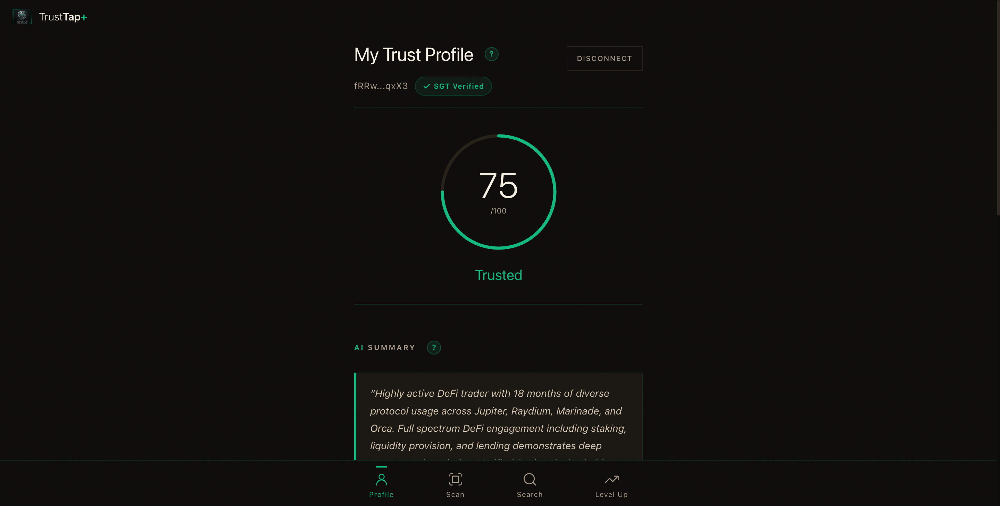
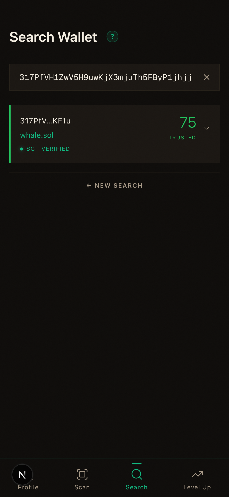
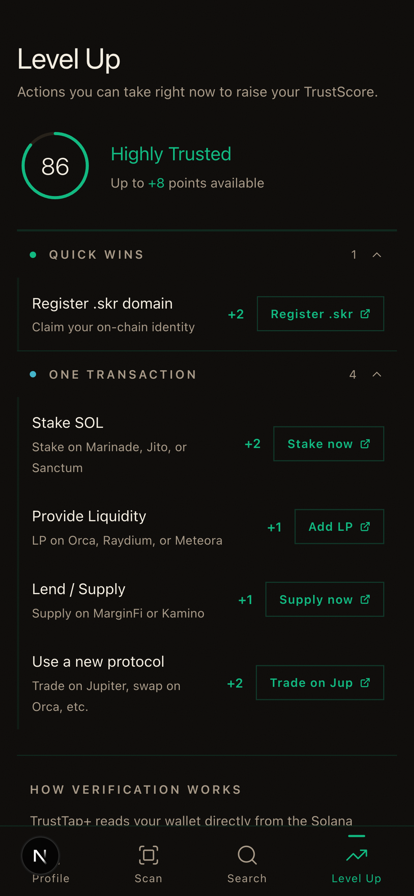
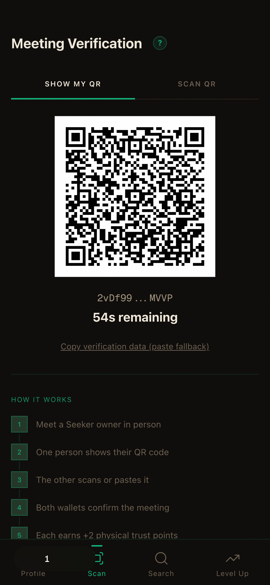
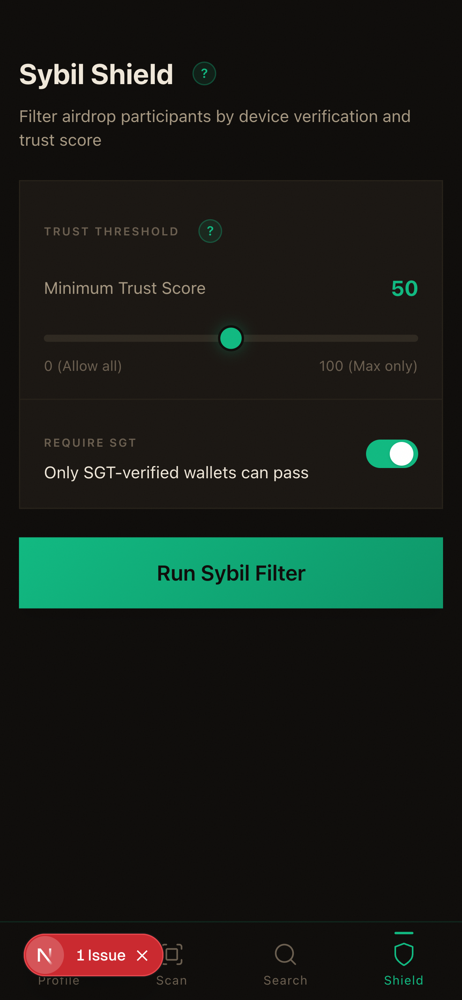

# TrustTap: Reputation Infrastructure for Solana Seeker

The trust layer that makes every dApp on Seeker safer. TrustTap scores wallets from 0 to 100 using on-chain history, hardware attestation (SGT), and cryptographic proof-of-meeting, then exposes that score as an API any dApp can query.

[](https://expo.dev/)
[](https://www.typescriptlang.org/)
[](https://solanamobile.com/)
[]()
[](LICENSE)



## Live Demo

**[trusttap.vercel.app](https://trusttap.vercel.app)**

Connect a wallet or explore with built-in demo wallets across all trust tiers.

## Demo Video

**[Watch on YouTube](https://youtu.be/Rq8BfpDrnZY)**

---

## What Is TrustTap?

Crypto has no way to verify the person behind a wallet. Sybil wallets captured 49% of the Arbitrum airdrop. P2P scams grew 40% year-over-year. 17,000 real users were incorrectly rejected from legitimate airdrops.

TrustTap solves this by combining three layers no other product has:

1. **Hardware attestation** via Saga Genesis Token (SGT). Each Seeker device has a soulbound NFT that cannot be faked, transferred, or duplicated. Cost of attack: $500 per identity.
2. **On-chain behavior analysis** across 19 Solana protocols, pulling real transaction history, DeFi depth, governance participation, and portfolio composition through the Helius RPC API.
3. **Physical meeting verification** using QR codes and Ed25519 wallet signatures via Mobile Wallet Adapter. Two people scan each other, both sign, and a cryptographic proof-of-meeting is recorded on-chain via SPL Memo.

The result is a trust score from 0 to 100 that any dApp on the Solana dApp Store can query to filter bots, verify counterparties, and reward real users.

---

## Screenshots

| Profile | Search | Level Up | QR Scan |
|---------|--------|----------|---------|
|  |  |  |  |

| Sybil Shield |
|--------------|
|  |

---

## Features

### For Users
- **8-Dimension Trust Score**: Device (SGT), financial depth, wallet age, activity volume, protocol diversity, DeFi depth, identity signals, and physical meetings
- **QR Meeting Verification**: Scan in person to cryptographically prove you met another wallet holder (Ed25519 signatures, SPL Memo on-chain)
- **Level Up Recommendations**: AI-powered suggestions for improving your score based on current wallet gaps
- **SKR Tipping**: Send Seeker Rewards tokens to trusted users after viewing their profile or verifying a meeting
- **AI Trust Summaries**: Natural language wallet analysis powered by Groq LLM
- **Wallet Lookup**: Search any Solana address or .sol/.skr domain to view their trust profile

### For the Ecosystem
- **Sybil Shield API**: Projects query trust scores to filter bot wallets from airdrops, governance, and token distributions
- **Network Graph API**: Map on-chain social connections between verified wallets
- **SKR-Native Scoring**: .skr domains earn higher identity scores than .sol domains, rewarding Seeker-native identity
- **Open API**: 10 serverless endpoints, no authentication required. Any dApp can integrate trust scoring today.

---

## Why Seeker?

TrustTap cannot exist on any other phone.

The Saga Genesis Token is a soulbound NFT tied to the Seeker hardware. It provides a $500 cost-of-attack floor per identity. No software wallet, no browser extension, and no other device can replicate this. SGT is worth 25 of 100 possible trust points, making hardware attestation the single largest scoring dimension.

Mobile Wallet Adapter (MWA) enables on-device signing for meeting verifications without exposing private keys. The QR scan flow opens MWA, both parties sign, and the meeting proof is committed to Solana via SPL Memo. This physical verification layer is what separates TrustTap from every other reputation system in crypto.

---

## SKR Integration

Seeker Rewards (SKR) are integrated as both a utility and a scoring signal:

- **Tipping**: Send SKR to other users directly from their trust profile or after a meeting verification. Builds an SPL token transfer with automatic Associated Token Account creation.
- **Identity scoring**: Wallets with .skr domains earn 4 identity points vs 2 for .sol domains. This rewards Seeker-native identity adoption.
- **Balance display**: SKR balance is shown on user profiles, queryable via `/api/skr-balance/[address]`.

---

## Tech Stack

| Layer | Technology |
|-------|-----------|
| Mobile App | React Native (Expo) + Mobile Wallet Adapter |
| API Backend | Next.js 16 App Router (Vercel serverless) |
| Language | TypeScript (strict mode) |
| Wallet | Solana Mobile Wallet Adapter (MWA) |
| On-Chain Data | Helius RPC API |
| AI Summaries | Groq API (Llama 3) |
| QR Verification | react-qr-code + html5-qrcode |
| Cryptography | tweetnacl + bs58 (Ed25519 signatures) |
| On-Chain Proofs | SPL Memo Program v2 |
| Token Transfers | @solana/spl-token (SKR tipping) |
| Testing | Vitest + Testing Library (124 tests) |
| Build | EAS Build (Android APK) |

---

## Try It Out

### Download the APK

**[Download from EAS Build](https://expo.dev/accounts/defidamii/projects/trusttap-plus/builds/c556be2c-d86f-4171-90e4-6b734f66152c)**

Install on any Android device or emulator. The app runs in demo mode with pre-loaded wallets.

1. **Profile**: View the trust score dial, 8-dimension breakdown, AI summary, and meeting history
2. **Search**: Paste any demo wallet address to see different trust tiers
3. **Level Up**: Toggle recommended actions to preview how they change your projected score
4. **QR Scan**: Generate and scan QR codes for in-person meeting verification
5. **Sybil Shield**: Low-scoring wallets show which suspicious patterns were flagged

### Demo Wallets

| Address | Score | Tier |
|---------|-------|------|
| `eHHHqVwd1DsmwmbK913uRTXKB7wT35uP775HVRffRDB3` | 86 | Highly Trusted |
| `fRRwPwbb9wqTbf9ZDHjMRVKZoDBPsjsP7Rh7VZVMqxX3` | 75 | Trusted |
| `M75RjudB15Mo7HZos9FHDRHTo9M3uTjPwdZdVq3KmMuZ` | 67 | Trusted |
| `Rb5RTuodu9VHMMVPhwXjMFTwqyDuwfH1ouZFqXTZXTsT` | 55 | Established |
| `C5myTZf59hw5X9BMoHyDmMBh5Rq3fy5yqb3XFFyh1Ddd` | 38 | Basic |
| `GVX1bw3wFqyDH3yBF3Zyq1DbsP1DmwwPFjfyyqVZRH1F` | 31 | Basic |

### On a Real Seeker

"Connect Wallet" opens Mobile Wallet Adapter, connects to your real wallet, and computes a live trust score from on-chain data. SGT holders get the full 25-point Device bonus.

---

## How It Works

### Scoring Algorithm

The trust score is a weighted sum across 8 dimensions (100 points max):

| Dimension | Max Points | Method |
|-----------|-----------|--------|
| Device (SGT) | 25 | Binary: soulbound NFT present or not |
| Financial Depth | 10 | Tiered by total portfolio in SOL-equivalent |
| Wallet Age | 10 | Asymptotic curve: score = 10 x (1 - e^(-days/240)) |
| Activity Volume | 10 | Tiered by transaction count (10+ to 5000+) |
| Protocol Diversity | 10 | Unique protocol count + bonuses for CLMMs, derivatives, vaults |
| DeFi Depth | 13 | Graduated: staking (0-5) + LP (0-4) + lending (0-4) |
| Identity | 10 | .skr domain (4) / .sol (2) + NFTs (0-3) + governance (0-3) |
| Physical Meetings | 12 | Graduated tiers from 1 meeting (3 pts) to 5+ (12 pts) |

### Anti-Gaming

- 5 meetings per day maximum
- 7-day cooldown between the same wallet pair
- 60-second challenge expiry for QR verification
- Sybil detection flags bot-like patterns: low age + high activity, airdrop farming signatures, shallow DeFi engagement

### Architecture

```
React Native App (Android APK)
  |
  +--- Mobile Wallet Adapter ---> Solana Wallet (sign/connect)
  |
  +--- Next.js API (Vercel) ----> Scoring Engine
  |         |                        |
  |         +--- Helius RPC -------> Solana Mainnet (read-only)
  |         |         |
  |         |         +--- Transaction history (19 protocols)
  |         |         +--- Token balances (SGT, SKR, NFTs, LSTs)
  |         |         +--- Account age, staking, governance
  |         |
  |         +--- Groq LLM --------> Natural language trust summary
  |         |
  |         +--- Sybil Engine ----> Pattern detection + bot flagging
  |
  +--- QR + Ed25519 Sigs -------> In-person meeting verification
  |                                   |
  +--- SPL Memo -----------------> On-chain proof-of-meeting
```

---

## API Reference

All endpoints are serverless functions on Vercel.

| Method | Endpoint | Description |
|--------|----------|-------------|
| GET | `/api/profile/[address]` | Fetch full trust profile for a wallet |
| POST | `/api/analyze-wallet` | Run wallet analysis with live Helius data |
| POST | `/api/sybil-check` | Run sybil detection on a wallet |
| GET | `/api/network/[wallet]` | Get wallet's on-chain network graph |
| GET | `/api/meetings/[address]` | List verified meetings for a wallet |
| POST | `/api/meeting/create` | Record a verified in-person meeting |
| POST | `/api/ai-summary` | Generate AI trust summary |
| GET | `/api/skr-balance/[address]` | Check SKR token balance |
| GET | `/api/resolve-domain` | Resolve .sol/.skr domain to wallet address |
| GET | `/api/demo-wallets` | Get all pre-computed demo wallet profiles |

---

## Running Locally

### API Backend

```bash
git clone https://github.com/dmustapha/trusttap.git
cd trusttap
npm install
cp .env.example .env.local
npm run dev
```

| Variable | Description |
|----------|-------------|
| `HELIUS_API_KEY` | Free API key from [helius.dev](https://helius.dev) |
| `GROQ_API_KEY` | Free API key from [console.groq.com](https://console.groq.com) |
| `DEMO_MODE` | Set to `true` to use pre-computed demo wallets |
| `NEXT_PUBLIC_DEMO_MODE` | Set to `true` for client-side demo mode |
| `NEXT_PUBLIC_USE_DEMO_SGT` | Set to `true` to simulate SGT ownership in dev |

### Mobile App

```bash
cd mobile
npm install
npx expo start
```

Build a release APK:

```bash
eas build --platform android --profile preview
```

### Tests

```bash
npm test
```

---

## Project Structure

```
trusttap/
├── src/
│   ├── app/                  # Next.js App Router
│   │   ├── page.tsx          # Landing / wallet connect
│   │   ├── profile/          # Trust profile dashboard
│   │   ├── search/           # Wallet lookup
│   │   ├── scan/             # QR meeting verification
│   │   ├── levelup/          # Score improvement suggestions
│   │   ├── shield/           # Sybil detection dashboard
│   │   ├── guide/            # First-time user guide
│   │   ├── badges/           # Trust tier badges
│   │   └── api/              # 10 serverless API routes
│   ├── components/           # UI components
│   ├── lib/
│   │   ├── scoring.ts        # Trust score algorithm (8 dimensions)
│   │   ├── helius.ts         # Helius RPC client
│   │   ├── skr.ts            # SKR token integration
│   │   ├── meeting-tx.ts     # Meeting transaction builder (SPL Memo)
│   │   ├── cache.ts          # Profile caching layer
│   │   ├── constants.ts      # Protocol IDs, token mints, thresholds
│   │   └── validation.ts     # Input validation + rate limiting
│   ├── types/                # TypeScript interfaces
│   ├── context/              # React context providers
│   ├── hooks/                # Custom React hooks
│   └── data/                 # Pre-computed demo wallet data
├── mobile/                   # React Native (Expo) Android app
│   ├── src/screens/          # Profile, Scan, Search, LevelUp
│   ├── src/hooks/            # Trust profile, meeting, wallet hooks
│   ├── src/context/          # Wallet context (MWA + demo mode)
│   └── eas.json              # EAS Build config (APK)
├── public/                   # PWA manifest, icons
└── docs/images/              # Screenshots
```

---

## License

MIT
